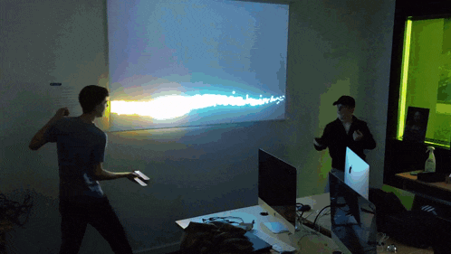

        
---
Welcome to the realm of Arcania. In this immersive interactive experience, you embody two wizards from the Citadel, whose families have been at war since time immemorial. Prepare yourself to engage in your ultimate battle and determine who will be the next king of the world of the Twelve. Use your phone as a magical wand and cast spells at your opponent using your own movements. At the end of the battle, review your performance and unlock achievements.

 

<div style="display:flex; justify-content:space-between; width:100%;">
<div>
<h1>Let's Play !</h1>
Go to <a>https://arcania.mathieu-chavanel.fr</a> and prepare you to fight !
</div>

</div>


# How to Play ?
- Go to [url](https://arcania.mathieu-chavanel.fr) on your Desktop
- With your phone Android or IOS (YEY it's finnaly work xD) scan QrCode than enter your pseudo and play start
- Next accept motion permission.
- Then follow the tutorial and the training part !

<div style="display:flex; justify-content:space-around; align-items:space-evenly; padding:20px">


<p style="margin-top:auto; font-weight:800; letter-spacing:2px">READY TO FIGHT ?</p>


</div>

# Installation
##  Install Dependencies    
```bash
git clone https://github.com/math-pixel/ARCANIA.git
cd ARCANIA
npm i
```

<h1>Change Mode to Development</h1>

<div style="display:flex; justify-content:space-between; width:100%;">


<div>

To run the application in localhost, open the `./src/services/projo/indexProjo.js` file and switch the variable `PRODUCTION_MODE` to `Development`.

</div>
</div>


## Use

On your computer open url :
```
http://localhost:3000/ or http://[computer-ip]:3000/
```

On your phone scan the qr code and use it a magic wand !

# License

GPL 3.0
<div style="display: flex; flex-direction:row; justify-content: space-around; margin:0; padding:0; max-height:20px;">


</div>